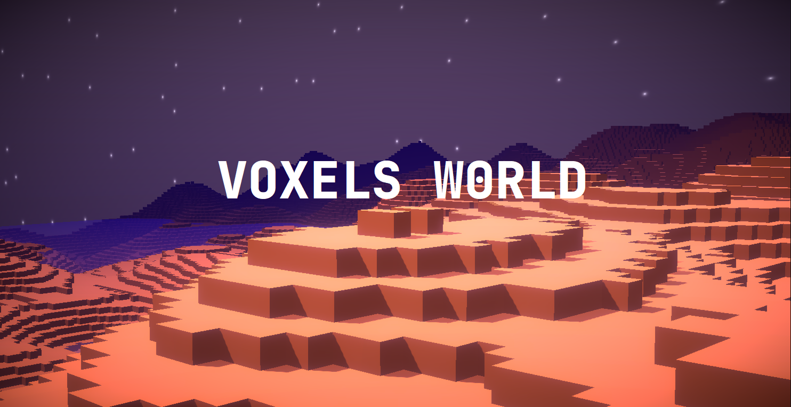
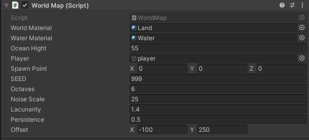

# VoxelWorldUnity
### Procedural Voxel Terrain Generator in Unity (Perlin Noise)


A **procedural voxel world generator built in Unity using Perlin noise**.  
This project was created as a side project to explore **procedural terrain generation**, **noise algorithms**, and **voxel-based environments**.

---


## Features – Procedural Terrain Generation

- **Octaves (Perlin Noise Layers)**  
  Multiple layers of Perlin noise blended together to increase terrain variation.

- **Lacunarity**  
  Controls the frequency scaling between octaves, improving terrain detail and controlling gaps in generation.

- **Persistence**  
  Controls terrain roughness by defining how height variation changes between octaves.



---

## How It Works

The terrain is generated using **Perlin noise** to calculate height values for each voxel column.  
Multiple octaves of noise are combined to control terrain frequency and roughness.  
The resulting height map is then converted into a **voxel-based terrain** inside Unity.

---

## Skybox & Shaders

The skybox was created using a simple custom shader.


---

## Installation & Usage

1. Clone the repository:
   ```bash
   git clone https://github.com/your-username/VoxelWorldUnity.git

2. Open the `src` folder on unity

## Learn more about procedural generation
▶️ [How Minecraft generates its worlds?? – YouTube](https://www.youtube.com/watch?v=0EMYMfoIy-k)
